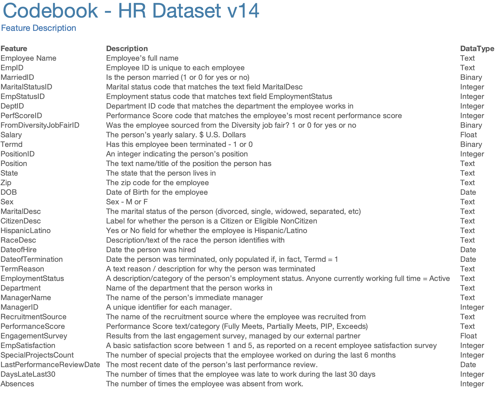
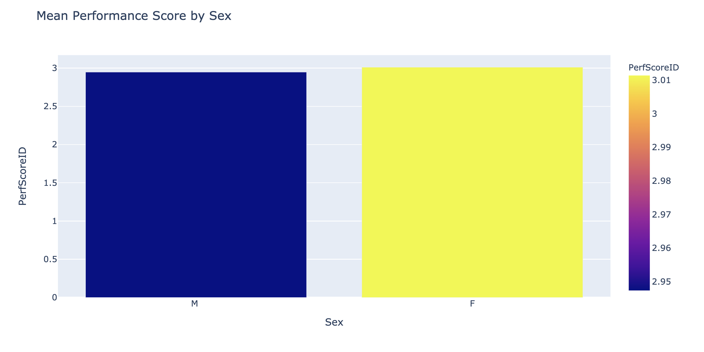
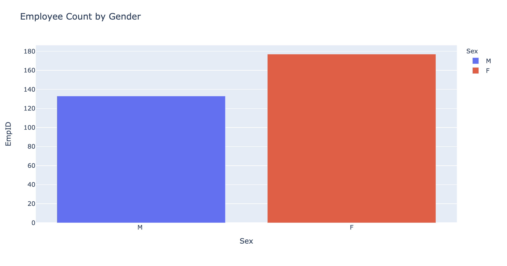

# Human_Capital_Analytics
## Exploration of HR Analytic Data of a fictions small company

### Introduction
The following synopsis was provided by Dr. Rich Hubber who published the data on kaggle.  

The HR Dataset was designed by Drs. Rich Huebner and Carla Patalano to accompany a case study designed for graduate HR students studying HR metrics, measurement, and analytics. The students use Tableau data visualization software to uncover insights about the case. This is a synthetic data set created specifically to go along with the case study (proprietary for the college that we teach at).

Every year or so, we update the data set to include additional columns, and to make slight changes to the underlying data. In this version, we add several new features to the data set:

Engagement Survey Results, a floating-point number, range between 1 and 5.
Special Project Count, integer, which is the number of special projects the employee worked on in the last year.
Last Performance Review Date, date, to ensure that all employees are receiving timely reviews.
Days Late in the Last 30 days, integer, as an attendance metric.

### Data Source
https://www.kaggle.com/rhuebner/human-resources-data-set?select=HRDataset_v13.csv

### Feature Dictionary

### NOTE: To view jupyter notebook html based content fully rendered, please use the nbviewer link:
https://nbviewer.jupyter.org/github/Vajrasamaya/Human_Capital_Analytics/tree/master/

## Visualizations

### Based on Sex

Not only are mean performance scores higher for women, but women constitute a majority of employees.

And yet, despite better performance reviews for women, and despite the fact that more employees in the company are women, higher pay is awarded to men.
